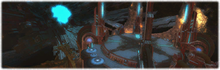

# This guide is WIP

---

Sections:

- [**What**](#what) the mechanics are
- [**When**](#when) they happen
- [**How**](#how) to do them (the strat)
- [Other tips](#other-tips)

## What

**Phase 1**\
At the start of the fight, there are 3 Scourge of Meracydia adds alongside the boss (Twintania).

Touching the edge of the arena is instant death.

- Plummet: Cleave
- Death Sentence: Tankbuster

Scourge of Meracydia:

- Liquid Hell: Leaves an orange circle on the ground that inflicts an unstackable DoT (Burns) while standing in it. Standing in multiple circles does not increase damage taken

Neurolink:\
The boss is restrained by 3 Neurolink rings. 1 breaks and drops under her as a persistent black circle at the end of phases 1, 2 and 4.

Standing in it inflicts the Neurolink debuff. This halves your damage dealt and healing received, and makes you move slightly slower. However, it lets you survive Aetheric Profusion & Hatch in later phases.

**Phase 2**

- Death Sentence: Now also inflicts 15s of Infirmity, reducing healing from spells (but not skills/abilities)

Firestorm:

- Marks a target with a blue marker for 3s, then traps them in a Conflagration. Does not target the first/second enmity
- Conflagration is a circular jail the same size as the boss's hitbox that always faces south. Anyone in range when or after it spawns will also get trapped
- Conflagration must be killed quickly or it will explode, dealing massive damage to everyone trapped inside (oneshots squishies)
- Trapped people suffer a weaker Burns DoT, but are otherwise immune to damage. If a trapped person dies to the DoT, the Conflagration immediately explodes

Fireball:

- Marks a target with a red marker for 5s, then hits them with a group soak AoE. Does not target the first/second enmity
- At least 4 people are needed for the stack to survive
- The boss gets a 25s stack of Waxen Flesh for each person hit, visualised with an orange tether
  - Waxen Flesh: Each stack shortens the time before Conflagration explodes (1 stack = 43s; 2 stacks = 28s; 3 stacks = 15s; 4 stacks = 12s; 5 stacks = 10s; 6 stacks = 9s). Stacks are checked when Conflagration spawns to determine its explosion timer
- If the target goes into a Conflagration to get trapped, Fireball is skipped and Conflagration's timer restarts

## When

**Phase 1**\
7s: Plummet (repeats every 13s)\
18s: Death Sentence (repeats every 35s)

**Phase 2** at <85% HP\
8s: Fireball marker (repeats every 25s)\
28s: Firestorm marker (repeats every 35s)

## How

**Phase 1**

- TODO waymarks map here\
  The MT should ignore the adds and grab the boss, positioning her on A and facing her away. Do this quickly before she uses Plummet to not cleave the party
  - We aim to drop her first Neurolink on A
- The OT should grab the adds and move them away from the boss. Adds should be killed first
- A healer should be assigned to each tank for when both are taking damage. I recommend the shield healer pocket the MT
  - Healers need to keep the MT topped up, as attacks can crit. Otherwise, the MT will likely die suddenly
- The MT must mit tankbusters. DPS should help with their group mits too. Death Sentence is usually followed by Plummet, which is a lethal combo, especially with auto-attacks

**Phase 2**

Resolving Fireball:

- We aim to have no more than 4 people soak Fireball to not make Conflagration harder
- 4 dps should stack to the bottom right of the boss as their default state. There will sometimes be less dps stacked due to Conflagration or deaths
  - We prioritise dps getting hit as they have more health than healers, and healers will get interrupted by the damage. The OT will be busy with timely tank swaps and pointing cleaves away
- 1 dps should be assigned the task of leaving the stack if there are too many people. The healers should be assigned a priority for who joins the stack first if there are too few people
  - To keep things simple, these 3 people should only adjust *after* the Fireball marker appears. We don't need to keep adjusting in between Fireballs, and we don't want edge cases like the first healer joining the stack, then the second healer getting marked
- When the Fireball marker appears, if Conflagration is up, the target should just go in and get trapped too (skips Fireball, restarts Conflagration's timer)
- Otherwise, the marked target must stay stacked/join the stack. Any dps who aren't stacked properly should get in position too. Then, adjust based on how many are now stacked.\
  e.g. if 4 dps are stacked (dps marked), don't move.\
  e.g. if 4 dps and 1 marked healer are stacked, the assigned dps should leave.\
  e.g. if 3 dps are stacked (dps marked), the first healer should join.\
  e.g. if 2 dps are stacked (dps marked), both healers should join
- Afterwards, reset your positioning and repeat. i.e. all dps should stack and healers should unstack

 

- After the first Fireball, the MT should move the boss onto B. We aim to drop her second Neurolink on B
- The MT should face the boss towards C while the OT stands to the left of the boss\
  TODO positioning infographic here
  - This allows clean tank swaps - neither tank has to move and Plummet won't cleave both tanks right after the swap. This is similar to how we handle Flare Breaths in T13. Meanwhile, dps can stay stacked in the same spot and hit positionals regardless of who's tanking, including on Conflagrations
- Tank swap *during* the Death Sentence castbar. Infirmity makes the combo even deadlier
- When the Firestorm marker appears, the target should sprint under the boss so everyone can reach the Conflagration

## Other Tips

- The boss's aggro range is massive at 30y. This almost covers the entire arena, so don't get too close
- You can pre-pull mage LB

Phase 1:

- The initial pull is a little tricky. Both tanks should run in together with stance on. The MT should only use single target attacks on the boss, while the OT AoEs everything. This way, each tank will be able to maintain aggro on their respective targets
- The MT can turn the boss if she gets covered by Liquid Hells, to help melees hit positionals

Phase 2:

- If the MT is about to die (e.g. a healer is trapped) and Conflagration is up, they can go in for the damage immunity
- Conflagration's timer is very janky, especially if the boss is busy with other queued attacks or gets stuck due to her top enmity being trapped
  - When a Fireball marker gets trapped, the timer tends to restart only after a delay, and sometimes doesn't restart at all
  - When the timer runs out, the explosion is sometimes delayed, and the delay can even be long enough to give you ample time to kill the Conflagration
  - I come to this conclusion after extensive analysis of hours of progs and unsync testing. The times corresponding to Waxen Flesh stacks I give above are the most sensible I could conclude with
- If you are struggling with Conflagration killing people, such as due to too many getting hit by Fireball, try to save your burst for it
- Squishies soaking Fireball can be good for LB generation due to surviving with little health

 

- If you are new to MINE ARR content like this, note that the philosophy for healers is very different. Healers will spend a lot of time casting MP-efficient GCD heals, especially if new people are taking a lot of damage. Your priority is to keep everyone alive as opposed to squeezing in damage

About outdated strats:

- Pets no longer have their own healthbars and don't count for mechanics
- The OT should not be chilling behind the boss. They will need to tank swap, and doing this can easily cleave the party and ruin positionals
- If your dps is good, you should only see 2 Firestorms
- It's not feasible to run this with 1 tank MINE, but damage shouldn't be a problem
