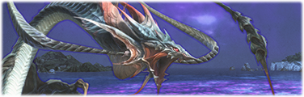

This site holds some of my detailed FFXIV guides for running old, high-end content at Minimum Item level, No Echo (MINE) - duty settings which make them harder.

MINE content has a niche audience. Some of the wikis/videos/other guides out there may be brief, outdated, or even inaccurate since the content is so old. This is a step towards improving that.

These guides compile my findings from having run and tested the content. Hopefully they're useful enough to teach you how to clear the fights too.

## A Realm Reborn

- [Leviathan | The Whorleater (Extreme)\
  ](leviathan)

---

Feedback? Bugs?

- [File a GitHub issue](https://github.com/Cloud7050/ff-mine/issues)
- PM me on Discord @ cloud7050
- [Join my static's Discord server](https://discord.gg/Ea7qqaxUyJ)

For MINE content on Materia DC (Oceania), check out the [ExMINE Discord server](https://discord.gg/HWb5BWWgJS).
